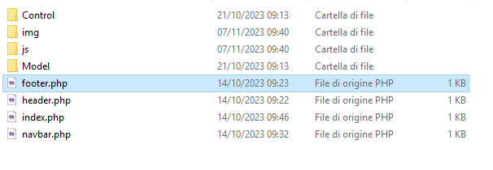

# MVC

Per la creazione di questo sito web, adotteremo il modello MVC (Model-View-Controller). Il modello MVC è un'architettura che suddivide un'applicazione in tre componenti principali:

 **Modello (Model):** Questa componente gestisce i dati e modella la realtà nella nostra applicazione. Nel nostro caso, useremo il model per connetterci al database al fine di estrarre e inserire i dati nella nostra base di dati, che rappresenterà gli elementi dell'e-commerce.

2. **Vista (View):** La Vista è responsabile della presentazione dei dati agli utenti. Nel contesto del nostro sito, la Vista comprende le pagine PHP che costituiscono l'aspetto visuale, come "header.php," "navbar.php," e "footer.php." Solitamente, la view è composta solo da HTML, CSS e JS al fine di rendere il sito scalabile. Tuttavia, in questa guida, abbiamo scelto di utilizzare PHP e l'uso di `include` per semplicità e per introdurre le potenzialità del PHP.

3. **Controller (Controller):** Il Controller funge da intermediario tra le richieste degli utenti e il Modello e la Vista. Nel nostro caso, lo utilizzeremo per indirizzare correttamente le richieste provenienti dalla view alle funzionalità del model e per prelevare i dati dal model e inviarli correttamente alla view.


L'adozione del modello MVC aiuta a separare in modo chiaro la gestione dei dati, la logica di presentazione e il controllo delle interazioni degli utenti all'interno dell'applicazione. Questa suddivisione migliora l'organizzazione del codice, ne facilita la manutenzione e la scalabilità, semplifica lo sviluppo del sito web e agevola la collaborazione in un team di sviluppo. Inoltre, il modello MVC è un approccio comune nel mondo dello sviluppo web e promuove buone pratiche di programmazione.

# Struttura del progetto

Il progetto realtivo a questa guida è organizzato in una struttura di cartelle che contribuisce a mantenere il codice e i file ben organizzati. Ecco come è strutturato il progetto:

- La **cartella principale( HTDOCS )** contiene i file chiave del sito web, tra cui "index.php," "navbar.php," e altri file principali che costituiscono le pagine visibili del sito.

- All'interno della cartella principale, troverai anche una serie di sottocartelle, ognuna con un ruolo specifico:

    - **img**: Questa cartella contiene le immagini e le risorse multimediali utilizzate nel sito, come loghi, immagini dei prodotti e altri file multimediali.

    - **controller**: La cartella "controller" ospita i file che contengono la logica di controllo dell'applicazione.

    - **model**: La cartella "model" contiene i file che rappresentano il modello dei dati dell'applicazione. 

    - **js**: La cartella "js" è dedicata a file JavaScript.

Questa organizzazione a cartelle contribuisce a mantenere il progetto pulito, ordinato e facilmente gestibile, garantendo che ogni componente del sito web sia al suo posto e ben strutturata.



# MODEL (userModel.php)

`userModel.php` è un componente chiave del Modello, e il suo scopo principale è gestire gli utenti. Questo file contiene tra le altre funzioni anche quella per la verifica delle credenziali degli utenti quando cercano di accedere al sito. La funzione `login` è un esempio di come questo processo di autenticazione potrebbe essere implementato all'interno del Modello.

```php

<?php
// Inizializzazione della sessione
session_start();

// La funzione login prende due parametri: $user e $pass, che rappresentano rispettivamente l'username e la password dell'utente.

function login($user, $pass) {
    // Verifica se l'username e la password sono corretti (nota: questo è solo un esempio semplificato).
    // Nella pratica, questa parte verrà sostituita da una chiamata a un database per verificare le credenziali.

    if ($user == "username" && $pass == "password") {
        // Se le credenziali sono corrette, impostiamo una variabile di sessione chiamata "username" con il valore di $user.
        $_SESSION["username"] = $user;

        // Ritorna 0 per indicare che l'accesso è riuscito.
        return 0;
    } else {
        // Se le credenziali non sono corrette, ritorna 1 per indicare che l'accesso è fallito.
        return 1;
    }
}

```

La pagina `userModel.php` che è stata fornita sembra essere un semplice esempio di un file PHP che contiene funzioni per la gestione dell'autenticazione degli utenti. Queste funzioni, anche se semplificate, possono aiutare a comprendere i concetti di base di PHP e la gestione di sessioni. Ecco una spiegazione step-by-step che tiene conto del fatto che la spiegazione è rivolta a persone che stanno apprendendo PHP per la prima volta:

1. `<?php`: Questo è il tag di apertura PHP e indica l'inizio di un blocco di codice PHP.

2. `session_start();`: Questa istruzione inizializza una sessione. Le sessioni sono una caratteristica di PHP che consente di memorizzare dati tra le pagine web.

3. La funzione `login($user, $pass)`: Questa è una funzione personalizzata che prende due parametri, `$user` e `$pass`, che rappresentano l'username e la password inseriti dall'utente.

4. All'interno della funzione, c'è un blocco condizionale (`if-else`):
   - L'istruzione `if` verifica se l'username e la password sono uguali a "username" e "password". Nota che questa è una simulazione semplificata. In un'applicazione reale, questa parte verrà sostituita da una query al database per verificare le credenziali dell'utente.
   - Se le credenziali sono corrette, viene impostata una variabile di sessione chiamata "username" con il valore dell'username dell'utente (`$_SESSION["username"] = $user;`). Questo `$user` rappresenta l'username fornito come argomento alla funzione.
   - Viene quindi ritornato "0" per indicare che l'accesso è riuscito.
   - Se le credenziali non sono corrette, viene ritornato "1" per indicare che l'accesso è fallito.

5. `?>`: Questo è il tag di chiusura PHP e indica la fine del blocco di codice PHP.

---

**Nota di Approfondimento:**

- Il simbolo `$` in PHP è utilizzato per definire e accedere alle variabili. In questo caso, `$user` è una variabile locale che rappresenta l'username passato come argomento alla funzione `login`.

- `$_SESSION["username"]` è una variabile di sessione in PHP. Le variabili di sessione sono utilizzate per memorizzare dati che devono persistere tra diverse pagine web o richieste. In questo caso, stiamo impostando la variabile di sessione "username" con il valore dell'username dell'utente. Questa variabile può essere utilizzata in altre parti dell'applicazione per verificare l'accesso dell'utente o per personalizzare l'esperienza utente in base all'username. È un esempio di vettore associativo, cioè di un vettore che ha come indici non dei numeri ma delle chiavi solitamente testuali. In questo caso "username" è la chiave e `$user` è il valore associato a quella chiave.


# CONTRL (userControl.php)

 Il file userControl.php rappresenta un esempio di un "controller" all'interno di un'applicazione web, facendo da smistamento tra l'interfaccia e il model

<?php
    // Includi il file del modello utente (userModel.php).
    require_once "../Model/userModel.php";

    // Leggi i dati inviati dalla richiesta HTTP (in formato JSON) e convertili in un array associativo.
    $Dati = json_decode(file_get_contents('php://input'), true);

    // Verifica l'azione specificata nei dati.
    if ($Dati["action"] == "login") {
        // Se l'azione è "login," chiama la funzione "login" dal modello utente con l'username e la password forniti.
        
        $errore = login($Dati["username"], $Dati["password"]);
        echo json_encode(['errore'=>$errore]);
    }
?>


**Spiegazione del Codice in userControl.php (Versione Aggiornata):**

1. `require_once "../Model/userModel.php";`: Questa istruzione importa (include) il file `userModel.php` dal percorso specificato. Il file `userModel.php` contiene le funzioni per la gestione dell'utente, inclusa la funzione `login`. Questo passaggio è importante perché ci consente di utilizzare le funzioni definite nel modello utente in questo script.

2. `$Dati = json_decode(file_get_contents('php://input'), true);`: Questa istruzione legge i dati inviati nella richiesta HTTP in formato JSON. I dati vengono letti da `php://input`, che rappresenta il corpo della richiesta. Successivamente, `json_decode` converte questi dati JSON in un array associativo PHP e li memorizza nella variabile `$Dati`. Questi dati possono includere l'azione specificata, l'username e la password.

3. `if ($Dati["action"] == "login") { ... }`: Questo blocco condizionale verifica se l'azione specificata nei dati è uguale a "login". Se l'azione è "login," il blocco di codice all'interno delle parentesi graffe verrà eseguito.

4. `$errore = login($Dati["username"], $Dati["password"]);`: Se l'azione è "login," viene chiamata la funzione `login` definita nel modello utente con l'username e la password forniti. La funzione `login` può restituire 0 se l'accesso è riuscito o 1 se l'accesso è fallito. Il risultato viene memorizzato nella variabile `$errore`.

5. `echo json_encode(['errore'=>$errore]);`: La risposta viene formattata come un oggetto JSON contenente il risultato dell'operazione di login. Questo oggetto JSON include una chiave chiamata 'errore' che contiene il valore restituito dalla funzione `login`, che può essere 0 se l'accesso è riuscito o 1 se l'accesso è fallito.

In sintesi, questo script PHP riceve una richiesta HTTP contenente dati in formato JSON, verifica l'azione specificata nei dati, e se l'azione è "login," chiama la funzione di login del modello utente con l'username e la password forniti. Il risultato della funzione di login viene quindi restituito come risposta HTTP, formattato in JSON, che può essere utilizzato per determinare se l'accesso è riuscito o fallito. Questo è un esempio semplice di come il modello, il controllore e i dati interagiscono all'interno di un'applicazione.

---

**Approfondimento: L'Importanza dei JSON**

**JSON (JavaScript Object Notation):** JSON è un formato di scambio dati leggero, indipendente dal linguaggio, che viene ampiamente utilizzato per rappresentare dati strutturati. I dati in formato JSON sono rappresentati come coppie di chiavi-valore e sono facili da leggere e scrivere sia per le macchine che per gli esseri umani.

**Perché JSON è Importante:**

1. **Interoperabilità:** JSON facilita l'interscambio di dati tra diverse applicazioni e sistemi. È un formato standardizzato e ampiamente supportato, il che significa che le informazioni possono essere condivise tra diversi componenti del software senza problemi di compatibilità.

2. **Lettura e Scrittura Facili:** La struttura dei dati JSON è chiara e ben organizzata. Questo lo rende facilmente comprensibile sia per gli sviluppatori che per i sistemi informatici. La leggibilità è un vantaggio significativo quando si tratta di debug e sviluppo.

3. **Rappresentazione dei Dati Strutturati:** JSON è adatto per la rappresentazione di dati strutturati come elenchi, oggetti annidati e array. Questa flessibilità lo rende adatto per una vasta gamma di applicazioni, dall'elaborazione di dati API REST all'archiviazione di configurazioni.

In sintesi, JSON è uno strumento essenziale per lo scambio di dati tra applicazioni e sistemi diversi. La sua semplicità, leggibilità e versatilità lo rendono un'opzione ideale per rappresentare dati strutturati in molte situazioni, inclusi servizi Web, applicazioni mobili, configurazioni di applicazioni e molto altro.


# VIEW(lognin.php)

Nell'ambito dello sviluppo web, una "vista" rappresenta l'aspetto visuale di un'applicazione web, ovvero ciò che gli utenti vedono e con cui interagiscono. La pagina login.php è un esempio di vista all'interno di un'applicazione web che gestisce il processo di accesso degli utenti.

```php
   <?php include_once 'header.php' ?>
    <?php include_once 'navbar.php' ?>

    <script src="./js/login.js"></script>

    <div class="row w-100">
        <div class="col-md-3"></div>
        <div class="col-md-6 justify-content-center">
            <form>
                <label class="w-25">username: </label> <input type="text" id="user" class="w-100 my-2"> 
                <label class="w-25">password: </label> <input type="password" id="pass" class="w-100 my-2"> 
                <input type="button" class="btn btn-success w-100 mt-5" onclick="login()" value="Entra">  
            </form>
        </div>
        <div class="col-md-3"></div>
    </div>

    <?php include_once 'footer.php' ?>
```

1. `<?php include_once 'header.php' ?>` e `<?php include_once 'navbar.php' ?>`: Queste istruzioni includono il codice HTML dei file `header.php` e `navbar.php`. Questo è un approccio comune per creare una struttura di pagina coerente e riutilizzabile. `header.php` solitamente include l'intestazione della pagina, mentre `navbar.php` include la barra di navigazione.

2. `<script src="./js/login.js"></script>`: Questa riga importa il file JavaScript `login.js`. Questo file JavaScript è responsabile dell'interazione dinamica con la pagina e verrà spiegato separatamente.

3. `<div class="row w-100">`: Questo `<div>` rappresenta una riga (row) in un layout Bootstrap. La classe `w-100` è utilizzata per garantire che il div occupi l'intera larghezza disponibile.

4. `<div class="col-md-3"></div>`: Questi due `<div>` rappresentano colonne (columns) vuote con una larghezza di 3 unità su 12. Questo viene utilizzato per creare spazi vuoti ai lati della sezione centrale.

5. `<div class="col-md-6 justify-content-center">`: Questo `<div>` rappresenta una colonna centrale con una larghezza di 6 unità su 12, occupando quindi metà della larghezza disponibile. La classe `justify-content-center` è utilizzata per centrare il contenuto orizzontalmente all'interno della colonna.

6. `<form>`: Questo elemento rappresenta un modulo HTML che gli utenti possono utilizzare per inserire dati, in questo caso, username e password.

7. `<label class="w-25">username: </label>` e `<input type="text" id="user" class="w-100 my-2">`: Queste righe rappresentano un campo per l'username. Il tag `<label>` fornisce una descrizione "username" per il campo di input, e l'elemento `<input>` con `type="text"` consente agli utenti di inserire il loro username. La classe `w-25` è utilizzata per definire una larghezza fissa del 25% per il label, mentre `w-100` definisce una larghezza del 100% per l'input. La classe `my-2` applica un margine superiore e inferiore al campo di input.

8. `<label class="w-25">password: </label>` e `<input type="password" id="pass" class="w-100 my-2">`: Queste righe rappresentano un campo per la password. Funzionano in modo simile a quanto spiegato per l'username, ma con il tipo di input `password` per nascondere i caratteri della password.

9. `<input type="button" class="btn btn-success w-100 mt-5" onclick="login()" value="Entra">`: Questa riga rappresenta un pulsante che gli utenti possono fare clic per avviare il processo di login. La classe `btn` è utilizzata per stili di pulsante Bootstrap, `btn-success` definisce uno stile di pulsante verde, `w-100` imposta la larghezza al 100%, e `mt-5` aggiunge un margine superiore al pulsante. L'attributo `onclick` chiama la funzione JavaScript `login()` quando il pulsante viene premuto.

10. `</form>`: Questo tag chiude il modulo del form.

11. `<div class="col-md-3"></div>`: Questo `<div>` rappresenta un'altra colonna vuota alla destra del modulo di login.

12. `<?php include_once 'footer.php' ?>`: Questa istruzione include il codice HTML dal file `footer.php`, che solitamente contiene il piè di pagina.

La pagina `login.php` fornisce una forma per l'inserimento di username e password e un pulsante per avviare il processo di login. La logica di gestione del login, inclusi i dettagli relativi al JavaScript, verrà spiegata separatamente una volta fornito il file JavaScript `login.js`.
